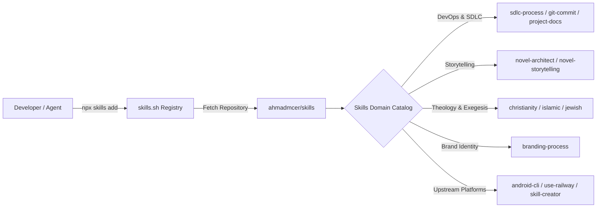

# Agent Skills Collection

> Production-grade, battle-tested agent skills for Google Antigravity, Claude, and modern AI coding assistants.

[](CHANGELOG.md)
[](LICENSE)
[](https://skills.sh)
[](https://github.com/astral-sh/ruff)
[](https://github.com/prettier/prettier)

---

## Architecture & Integration Flow

This repository implements the [Agent Skills Standard](https://skills.sh), providing modular operational intelligence, reference guides, deterministic validation schemas, and zero-dependency Python automation CLI tools for autonomous agent workflows.



---

## Quick Start

You can install any skill directly using [skills.sh](https://skills.sh) or by cloning this repository into your workspace's agent directory.

### 1. Install via skills.sh (Recommended)

```bash
# Install the entire skills catalog into your project
npx skills add ahmadmcer/skills

# Or install a specific individual skill
npx skills add ahmadmcer/skills --skill project-documentation
npx skills add ahmadmcer/skills --skill git-commit
npx skills add ahmadmcer/skills --skill novel-architect
```

### 2. Manual Git Clone

```bash
# Clone directly into your agent configuration directory
git clone https://github.com/ahmadmcer/skills.git .agents
```

---

## Prerequisites

- **Node.js**: `>= 18.0.0` (required for `npx skills add` and formatting tools)
- **Python**: `>= 3.10` (required for running included zero-dependency Python CLI utilities)
- **Git**: `>= 2.30.0`

---

## Skills Catalog

### 🛠 Software Engineering & Release Lifecycle

| Skill                                                        | Focus                                                                                                                                                 | Documentation                                     | Tools Included                                                      |
| :----------------------------------------------------------- | :---------------------------------------------------------------------------------------------------------------------------------------------------- | :------------------------------------------------ | :------------------------------------------------------------------ |
| **[`sdlc-process`](skills/sdlc-process/)**                   | End-to-end SDLC engineering, PRD drafting, Spec-Driven Development, ADRs, STRIDE threat modeling, and DORA metrics.                                   | [SKILL.md](skills/sdlc-process/SKILL.md)          | `calculate_dora_metrics.py`, `verify_sdlc_readiness.py`             |
| **[`git-commit`](skills/git-commit/)**                       | Conventional Commits 1.0.0, automated secret leak detection, and atomic git diff slicing.                                                             | [SKILL.md](skills/git-commit/SKILL.md)            | `prepare_commit.py`, `verify_commit_msg.py`                         |
| **[`changelog-versioning`](skills/changelog-versioning/)**   | Keep a Changelog 1.1.0, SemVer 2.0.0 calculation, zero-major rules, and 12-point quality auditing.                                                    | [SKILL.md](skills/changelog-versioning/SKILL.md)  | `determine_version.py`, `update_changelog.py`, `audit_changelog.py` |
| **[`project-documentation`](skills/project-documentation/)** | Diátaxis 4-quadrant layout, Docs-as-Code SSG scaffolding (VitePress/Docusaurus/Starlight/MkDocs), OpenAPI 3.1, C4 diagrams, and DocOps quality gates. | [SKILL.md](skills/project-documentation/SKILL.md) | `scaffold_docs.py`, `generate_api_doc.py`, `audit_docs.py`          |
| **[`create-readme`](skills/create-readme/)**                 | Codebase inspection, architecture extraction, and production-grade README generation tailored across 6 archetypes.                                    | [SKILL.md](skills/create-readme/SKILL.md)         | `inspect_project.py`, `generate_readme.py`, `audit_readme.py`       |

### 🖋 Creative Writing & Narrative Architecture

| Skill                                                  | Focus                                                                                                                                                       | Documentation                                  | Tools Included                                                     |
| :----------------------------------------------------- | :---------------------------------------------------------------------------------------------------------------------------------------------------------- | :--------------------------------------------- | :----------------------------------------------------------------- |
| **[`novel-architect`](skills/novel-architect/)**       | Macro narrative architecture, beat sheets (Save the Cat, Three-Act, Story Circle, 7-Point), character psychodynamics, and Scene & Sequel pacing.            | [SKILL.md](skills/novel-architect/SKILL.md)    | `generate_beat_sheet.py`, `analyze_pacing.py`, `scaffold_novel.py` |
| **[`novel-storytelling`](skills/novel-storytelling/)** | Prose craftsmanship, Gardner's 5 levels of psychic distance, Free Indirect Discourse, dialogue subtext & action beats, micro-tension, and sentence cadence. | [SKILL.md](skills/novel-storytelling/SKILL.md) | `expand_scene.py`, `lint_prose.py`                                 |

### 📜 Theological Exegesis & Scriptural Verification

| Skill                                                                                  | Focus                                                                                                                                                            | Documentation                                                  | Tools Included                                       |
| :------------------------------------------------------------------------------------- | :--------------------------------------------------------------------------------------------------------------------------------------------------------------- | :------------------------------------------------------------- | :--------------------------------------------------- |
| **[`christianity-scriptural-references`](skills/christianity-scriptural-references/)** | SBL Handbook of Style biblical citations, translation comparisons (ESV, NIV, KJV, NASB, NRSVue), Patristic/Reformation commentaries, original Hebrew/Greek text. | [SKILL.md](skills/christianity-scriptural-references/SKILL.md) | `format_biblical_citation.py`, `lookup_scripture.py` |
| **[`islamic-scriptural-references`](skills/islamic-scriptural-references/)**           | Holy Qur'an citations, Hadith takhrij & grading (Sahih, Hasan, Da'if), classical Tafsir (Ibn Kathir, al-Tabari, al-Sa'di), ALA-LC transliteration.               | [SKILL.md](skills/islamic-scriptural-references/SKILL.md)      | `format_islamic_citation.py`, `lookup_scripture.py`  |
| **[`jewish-scriptural-references`](skills/jewish-scriptural-references/)**             | Tanakh citations, Talmud Bavli/Yerushalmi tractates, classical Perushim (Rashi, Ramban, Ibn Ezra), halakhic codes (Mishneh Torah, Shulchan Aruch).               | [SKILL.md](skills/jewish-scriptural-references/SKILL.md)       | `format_jewish_citation.py`, `lookup_scripture.py`   |

### 🎨 Brand Strategy & Visual Identity

| Skill                                              | Focus                                                                                                                                             | Documentation                                | Tools Included                                 |
| :------------------------------------------------- | :------------------------------------------------------------------------------------------------------------------------------------------------ | :------------------------------------------- | :--------------------------------------------- |
| **[`branding-process`](skills/branding-process/)** | Brand strategy, positioning, archetype mapping, verbal voice & tone, accessible color palettes, responsive logos, and W3C/Tailwind design tokens. | [SKILL.md](skills/branding-process/SKILL.md) | `generate_tokens.py`, `scaffold_svg_assets.py` |

### 🌐 Curated Upstream Integrations

These skills originate from official upstream creators and are curated here for seamless integration into multi-agent workflows:

| Skill                                        | Author / Organization  | Description                                                                                            | Documentation                             |
| :------------------------------------------- | :--------------------- | :----------------------------------------------------------------------------------------------------- | :---------------------------------------- |
| **[`android-cli`](skills/android-cli/)**     | **Google / Android**   | Official Android platform tools, emulator management, APK deployment, and UI inspection.               | [SKILL.md](skills/android-cli/SKILL.md)   |
| **[`find-skills`](skills/find-skills/)**     | **Vercel / Skills.sh** | Discover, inspect, and install agent skills from open-source registries.                               | [SKILL.md](skills/find-skills/SKILL.md)   |
| **[`skill-creator`](skills/skill-creator/)** | **Anthropic**          | Benchmarking, evaluation, and iteration toolchain for agent skill development.                         | [SKILL.md](skills/skill-creator/SKILL.md) |
| **[`use-railway`](skills/use-railway/)**     | **Railway**            | Cloud infrastructure operations, database diagnostic analysis, OpenTelemetry tracing, and deployments. | [SKILL.md](skills/use-railway/SKILL.md)   |

---

## Usage & Practical Examples

### Example 1: Prompting an AI Assistant to Use a Skill

When pairing with Google Antigravity, Claude Code, or any compatible AI agent, skills trigger autonomously based on natural language requests:

```text
User: "Audit our technical documentation in ./docs for broken links and generate an API reference from openapi.json."
Agent: [Activates project-documentation skill]
       1. Runs audit_docs.py --dir ./docs to verify link integrity and frontmatter.
       2. Runs generate_api_doc.py --spec openapi.json --output ./docs/reference/api.md.
       3. Reports quantitative DocOps health score and generated reference endpoints.
```

### Example 2: Standalone CLI Automation

Every custom skill in this repository includes zero-dependency Python 3.10+ CLI tools that developers can execute directly in their terminal without relying on an agent:

```bash
# 1. Inspect any codebase and generate a tailored README.md
python skills/create-readme/scripts/inspect_project.py .
python skills/create-readme/scripts/audit_readme.py README.md

# 2. Determine your next Semantic Version and update CHANGELOG.md
python skills/changelog-versioning/scripts/determine_version.py
python skills/changelog-versioning/scripts/audit_changelog.py --file CHANGELOG.md

# 3. Scaffold a Diátaxis documentation portal (VitePress, Docusaurus, MkDocs, Starlight)
python skills/project-documentation/scripts/scaffold_docs.py --generator vitepress --target-dir ./docs

# 4. Audit your documentation workspace for link rot and dead anchors
python skills/project-documentation/scripts/audit_docs.py --dir ./docs --strict

# 5. Lint manuscript fiction for filter words, rhythm, and dialogue tags
python skills/novel-storytelling/scripts/lint_prose.py chapter1.md
```

---

## Testing & Quality Assurance

All skills, scripts, and evaluation suites are continuously validated against strict portability gates and linting standards:

```bash
# Run skill structural validation on any skill
python skills/skill-creator/scripts/validate_skill.py skills/project-documentation
python skills/skill-creator/scripts/validate_skill.py skills/create-readme
python skills/skill-creator/scripts/validate_skill.py skills/changelog-versioning

# Run Python linting and formatting checks
ruff check .
ruff format --check .

# Run Markdown and JSON formatting verification
npx prettier --check "**/*.md" "**/*.json"

# Run Markdown linting rules
npx markdownlint-cli2 "**/*.md"
```

---

## Repository Structure

```text
.
├── .github/                          # Issue and Pull Request templates
├── commands/                         # Custom agent slash command extensions
├── skills/                           # 15 production Agent Skills
│   ├── android-cli/                  # Upstream: Google / Android
│   ├── branding-process/             # Brand strategy & design tokens
│   ├── changelog-versioning/         # SemVer 2.0.0 & Keep a Changelog 1.1.0
│   ├── christianity-scriptural-references/ # Biblical exegesis & SBL citations
│   ├── create-readme/                # Codebase inspection & README generation
│   ├── find-skills/                  # Upstream: Vercel / Skills.sh
│   ├── git-commit/                   # Conventional Commits 1.0.0 engine
│   ├── islamic-scriptural-references/# Qur'an & Hadith authentication
│   ├── jewish-scriptural-references/ # Tanakh, Talmud, and rabbinic citations
│   ├── novel-architect/              # Plotting, beat sheets, and character arcs
│   ├── novel-storytelling/           # Deep POV, sensory craft, and micro-tension
│   ├── project-documentation/        # Diátaxis framework & DocOps quality gates
│   ├── sdlc-process/                 # PRDs, Spec-Driven Development, and TDD
│   ├── skill-creator/                # Upstream: Anthropic
│   └── use-railway/                  # Upstream: Railway
├── pyproject.toml                    # Ruff Python linter & formatter configuration
├── .prettierrc.json                  # Prettier Markdown & JSON formatting rules
├── .markdownlint.json                # DocOps Markdown quality lint rules
├── CHANGELOG.md                      # Keep a Changelog 1.1.0 release history
├── CONTRIBUTING.md                   # Contribution and skill authoring guide
├── SECURITY.md                       # Vulnerability reporting & secret protection
└── LICENSE                           # MIT License & Third-Party Notices
```

---

## Contributing

We welcome community contributions, improvements, and new agent skills! Please consult [CONTRIBUTING.md](CONTRIBUTING.md) for skill authoring guidelines, evaluation standards, and automated validation procedures.

To validate any skill prior to submitting a pull request:

```bash
python skills/skill-creator/scripts/validate_skill.py skills/<skill-name>
```

---

## Third-Party Notices & Trademarks

- **Android** is a trademark of Google LLC.
- **Skills.sh** is operated by Vercel Inc.
- **Claude** and **Anthropic** are trademarks of Anthropic PBC.
- **Railway** is a trademark of Railway Corp.

Upstream skills are attributed in [LICENSE](LICENSE) and retain their respective author copyrights. All original skills created by Ahmad Nawawi (<ahmadmcer@gmail.com>) are licensed under the [MIT License](LICENSE).
