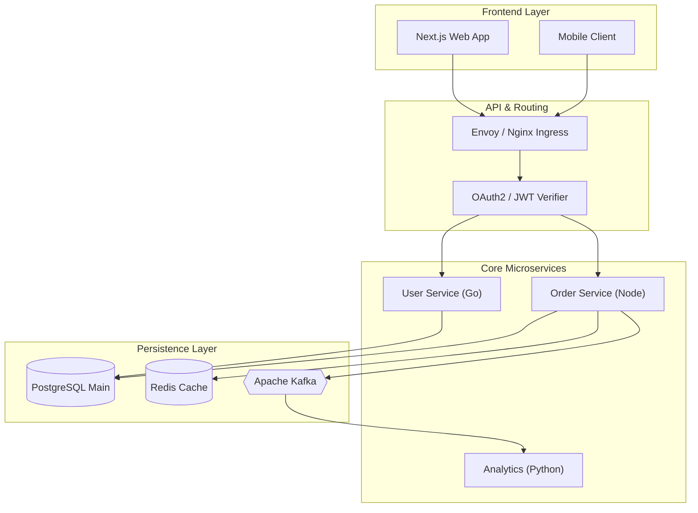
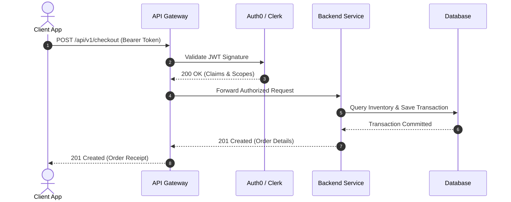
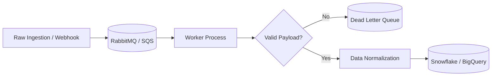

# Architecture Diagrams and Visuals Guide

A guide to integrating GitHub-native **Mermaid diagrams**, annotated **ASCII trees**, and optimized visual media into technical documentation.

---

## 1. Why Visuals Matter

Developers scan READMEs visually before committing to reading prose. A well-placed diagram answers the architectural questions:
- *How do the components talk to each other?*
- *Where does this service sit in the infrastructure stack?*
- *What is the request/response lifecycle?*

---

## 2. GitHub-Native Mermaid Diagram Recipes

GitHub renders Mermaid diagrams natively in markdown fences using ```` ```mermaid ```` blocks.

### 1. Fullstack Architecture Flowchart


### 2. Request & Authentication Sequence Diagram


### 3. Asynchronous Data Pipeline


---

## 3. Annotated ASCII Directory Trees

When describing codebase architecture, a full directory dump overwhelms the reader. Curate an annotated ASCII tree that highlights domain boundaries:

```
┌────────────────────────────────────────────────────────────────────────┐
│                        ASCII TREE RULES                                │
├────────────────────────────────────────────────────────────────────────┤
│ 1. Omit Noise    → Exclude node_modules, .git, dist, __pycache__, logs │
│ 2. Max 3 Levels  → Keep nesting shallow; link to sub-packages if deep  │
│ 3. Annotate      → Add inline comments explaining the responsibility   │
└────────────────────────────────────────────────────────────────────────┘
```

### Example Annotated Tree:
```
my-platform/
├── apps/
│   ├── web/                    # Next.js customer-facing portal
│   └── docs/                   # Mintlify / Astro documentation site
├── packages/
│   ├── api-client/             # Generated TypeScript SDK
│   ├── config/                 # Shared ESLint, Prettier, and TS configs
│   └── database/               # Prisma schema & database migrations
├── services/
│   ├── auth/                   # Identity & token management service
│   └── worker/                 # Background job processor (Celery)
├── docker-compose.yml          # Local multi-service orchestrator
├── Makefile                    # Standard developer automation targets
└── README.md                   # Repository welcome mat
```

---

## 4. Media & Terminal Demos

### Guidelines for Screenshots & Recordings:
1. **Compress Images**: Keep images under 200 KB. Use WebP or compressed PNG.
2. **Terminal Recordings**: For CLI tools, use [VHS](https://github.com/charmbracelet/vhs) to generate crisp, deterministic terminal GIFs or SVGs.
3. **Contrast & Theme**: Ensure text within screenshots is clearly legible in both GitHub Dark Mode and Light Mode.
4. **Relative Paths**: Store assets within the repository under `docs/images/` or `.github/assets/`.
