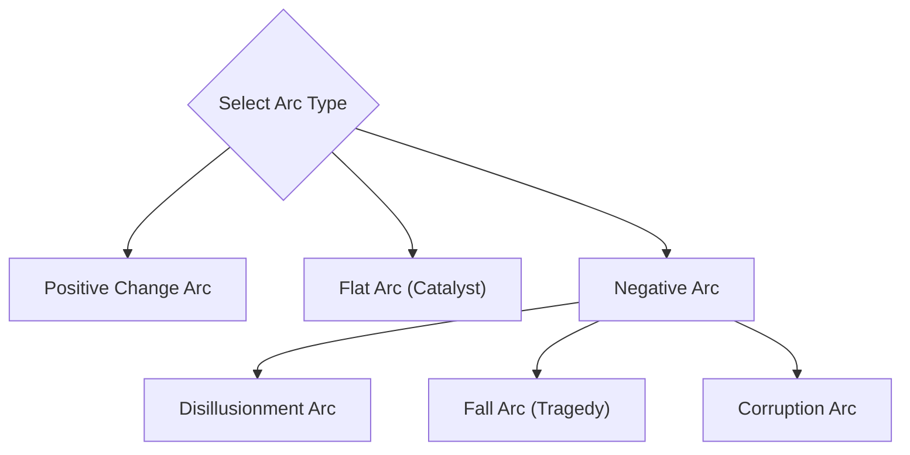

# Character Arcs and Narrative Psychology

A deep reference guide to character arc engineering, internal psychodynamics, and voice differentiation based on K.M. Weiland's character arc architecture.

---

## 1. The Four Pillars of Character Architecture

Compelling characters are not static lists of traits; they are dynamic psychological systems undergoing pressure from external circumstances.

```
┌────────────────────────────────────────────────────────────────────────┐
│                   THE 4 PILLARS OF CHARACTER ARCS                      │
├────────────────────────────────────────────────────────────────────────┤
│ 1. THE GHOST / WOUND  → Past trauma or lack shaping the worldview      │
│ 2. THE LIE            → Flawed coping mechanism / protective myth      │
│ 3. WANT VS. NEED      → External tangible goal vs internal growth      │
│ 4. MOMENT OF TRUTH    → Climactic decision rejecting the Lie           │
└────────────────────────────────────────────────────────────────────────┘
```

### 1. The Ghost (The Backstory Wound)

The Ghost is the unhealed historical event, loss, betrayal, or systemic failure that inflicted emotional trauma on the character before the story began:

- It explains _why_ the character behaves defensively or irrationally.
- It is often revealed gradually across Act 1 and Act 2A rather than dumped in the opening pages.

### 2. The Lie the Character Believes

Born directly from the Ghost, the Lie is a self-protective misconception the character adopts to avoid being hurt again:

- _Example_: _"I can only rely on myself; trusting others leads to betrayal."_
- _Example_: _"If I become wealthy and powerful, no one can ever humiliate me."_
- The Lie forms the character's armor, but also stunts their emotional maturity.

### 3. The Want vs. Need Dynamic

The central tension of any character-driven story is the war between conscious desire and unconscious growth:

- **The Want (External Goal)**: The tangible, observable objective the character pursues in the plot (e.g. win the prize, gain the promotion, avenge a parent, escape a city). The character believes achieving the Want will bring fulfillment.
- **The Need (Thematic Truth)**: The internal, spiritual, or relational realization the character must embrace to achieve wholeness. The Need requires abandoning the Lie.
- **The Conflict**: In the climax, the character is forced to choose between satisfying their external _Want_ or embracing their internal _Need_.

### 4. The Moment of Truth

Occurring during the Third Act (often between Break into Three and the Finale), the character is stripped of their weapons, allies, and fallback plans:

- They must consciously acknowledge the Lie, discard it, and act on the Truth—even if it means sacrificing their original Want.

---

## 2. Character Arc Taxonomies



### 1. The Positive Change Arc

- **Trajectory**: Begins believing the Lie &rarr; resists the Truth &rarr; experiences crisis when the Lie fails them &rarr; embraces the Truth &rarr; overcomes the external challenge.
- **Classic Examples**: Katniss Everdeen (_The Hunger Games_), Ebenezer Scrooge (_A Christmas Carol_), Michael Corleone in reverse.

### 2. The Flat Arc (The Catalyst Hero)

- **Trajectory**: Starts already knowing the Truth &rarr; enters a world infected by a Lie &rarr; remains steadfast under intense pressure &rarr; acts as a catalyst transforming the surrounding society or allies.
- **Classic Examples**: Sherlock Holmes, Atticus Finch (_To Kill a Mockingbird_), Paddington Bear, Captain America (_The Winter Soldier_).

### 3. The Three Negative Change Arcs

1. **The Disillusionment Arc**: Character begins believing a hopeful lie (idealism), but experiences the brutal truth of the world, ending in somber, tragic maturity (_The Great Gatsby_).
2. **The Fall Arc (Classical Tragedy)**: Character believes the Lie, clings to it deeper when tested, and makes increasingly immoral choices that lead to ruin (_Macbeth_, _Breaking Bad_'s Walter White).
3. **The Corruption Arc**: Character begins knowing the Truth, is seduced by power, greed, or vengeance, and actively chooses the Lie, ending as a monster (_The Godfather_'s Michael Corleone, Anakin Skywalker).

---

## 3. Character Dossier Template

When building major characters, document their profile using this structured schema:

```markdown
# Character Dossier: [Character Name]

### Core Profile

- **Role**: Protagonist / Antagonist / Mentor / Foil
- **Archetype**: [e.g. The Rebel / The Guardian / The Trickster]
- **Age & Occupation**: [Age, primary vocation/skills]
- **High-Concept Pitch**: [One punchy sentence capturing their contradictions]

### Psychodynamics

- **The Ghost (Backstory Wound)**: [Specific trauma, loss, or lack]
- **The Lie They Believe**: [The flawed belief they use to protect themselves]
- **The Thematic Truth**: [The reality they must learn to grow]
- **The Want (External Objective)**: [Specific, tangible story goal]
- **The Need (Internal Growth)**: [The moral/emotional transformation required]
- **Fatal Flaw**: [Pride, cynicism, cowardice, control, recklessness]

### Relationships & Foils

- **Primary Antagonist/Nemesis**: [How their worldviews clash]
- **The Foil / Mirror**: [Character possessing the traits the protagonist lacks]
- **The B-Story Mentor/Anchor**: [Who challenges their Lie]

### Signature Voice & Demeanor

- **Dialogue Cadence**: [Sentence length, vocabulary, formal vs colloquial]
- **Physical Tells / Mannerisms**: [Habitual gestures under stress]
- **Contradiction**: [An unexpected trait that breaks cliché]
```
