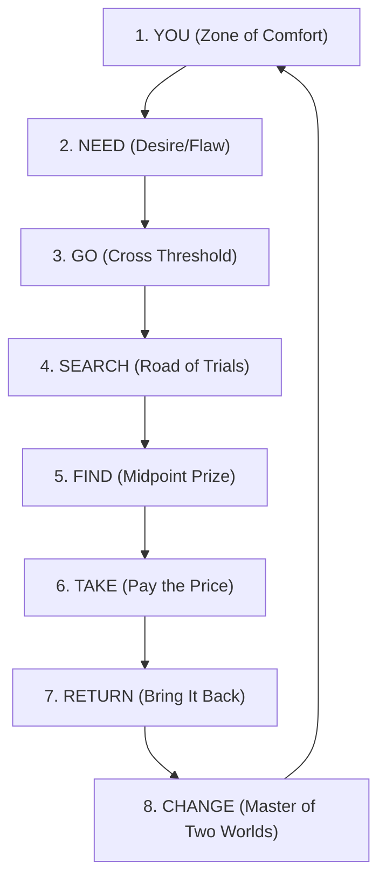

# Narrative Frameworks and Beat Sheets Guide

A comprehensive architectural guide and reference for the five major novel plotting frameworks: **Save the Cat! Writes a Novel**, **The Three-Act / 8-Sequence Model**, **Dan Harmon's Story Circle**, **The Seven-Point Structure**, and **The Snowflake Method**.

---

## 1. Save the Cat! Writes a Novel (Jessica Brody / Blake Snyder)

Adapted from Blake Snyder’s cinematic beat sheet, Jessica Brody’s framework calibrates a novel into **15 distinct emotional and structural beats** distributed by precise percentage milestones.

### Word Count Allocations for an 80,000-Word Novel

| Beat Number | Beat Name                  | Target %  | Target Word (80k) | Cumulative Range (80k) | Dramatic Purpose                                                                                                          |
| :---------- | :------------------------- | :-------- | :---------------- | :--------------------- | :------------------------------------------------------------------------------------------------------------------------ |
| **Beat 1**  | **Opening Image**          | 0% – 1%   | 0 – 800           | 0 – 800                | Snapshot of the protagonist’s flawed status quo before transformation.                                                    |
| **Beat 2**  | **Theme Stated**           | ~5%       | ~4,000            | 4,000                  | A statement by a minor character or event hinting at the life lesson/truth the protagonist needs.                         |
| **Beat 3**  | **Set-Up**                 | 1% – 10%  | 800 – 8,000       | 800 – 8,000            | Explores the protagonist's ordinary world, their Lie, flaw, and supporting cast.                                          |
| **Beat 4**  | **Catalyst**               | 10%       | 8,000             | 8,000                  | The inciting incident that shatters the status quo. Cannot be ignored.                                                    |
| **Beat 5**  | **Debate**                 | 10% – 20% | 8,000 – 16,000    | 8,000 – 16,000         | The protagonist hesitates, assesses risks, or tries to resist the call to adventure.                                      |
| **Beat 6**  | **Break Into Two**         | 20%       | 16,000            | 16,000                 | The protagonist makes an active decision to leave the old world and enter the new world.                                  |
| **Beat 7**  | **B Story**                | 22%       | 17,600            | 17,600                 | Introduction of the mentor, love interest, or nemesis who will help teach the Theme.                                      |
| **Beat 8**  | **Fun and Games**          | 20% – 50% | 16,000 – 40,000   | 16,000 – 40,000        | "The Promise of the Premise." Exploring the upside/downside of the new world.                                             |
| **Beat 9**  | **Midpoint**               | 50%       | 40,000            | 40,000                 | Pivot point: either a **False Victory** (higher stakes) or **False Defeat**; character shifts from reactive to proactive. |
| **Beat 10** | **Bad Guys Close In**      | 50% – 75% | 40,000 – 60,000   | 40,000 – 60,000        | External pressure mounts while internal doubts/fissures tear the team apart.                                              |
| **Beat 11** | **All Is Lost**            | 75%       | 60,000            | 60,000                 | Total collapse of the original plan. "Whiff of Death" (symbolic or literal).                                              |
| **Beat 12** | **Dark Night of the Soul** | 75% – 80% | 60,000 – 64,000   | 60,000 – 64,000        | The emotional rock bottom where the protagonist mourns and processes the loss.                                            |
| **Beat 13** | **Break Into Three**       | 80%       | 64,000            | 64,000                 | Epiphany! The protagonist embraces the Theme/Truth and formulates a new plan.                                             |
| **Beat 14** | **Finale**                 | 80% – 99% | 64,000 – 79,200   | 64,000 – 79,200        | The climactic showdown executing the five-part finale structure.                                                          |
| **Beat 15** | **Final Image**            | ~100%     | 79,200 – 80,000   | 79,200 – 80,000        | Mirror to the Opening Image, proving profound internal and external transformation.                                       |

### The Five-Part Finale Breakdown (Beat 14)

1. **Gathering the Team**: Protagonist unites allies, admits past mistakes, and outlines the new plan based on the Truth.
2. **Executing the Plan**: The team infiltrates the antagonist's domain or initiates the offensive.
3. **The High Tower Surprise**: An unexpected twist or betrayal shatters the new plan; the antagonist anticipated them.
4. **Dig Deep Down**: Without tools, weapons, or mentors, the protagonist must rely entirely on their internal growth (the Truth).
5. **Executing the New Plan**: The climactic act that resolves the primary conflict once and for all.

---

## 2. The Three-Act / 8-Sequence Model

Common in literary fiction and classical screenwriting, this model divides a novel into four 25% quadrants, each containing two 10-15% sequences:

```
┌────────────────────────────────────────────────────────────────────────┐
│                        THE 8-SEQUENCE STRUCTURE                        │
├────────────────────────────────────────────────────────────────────────┤
│ ACT 1 (0% - 25%):                                                      │
│   • Sequence 1: Status Quo & Inciting Incident (0% - 12.5%)            │
│   • Sequence 2: Predicament & Lock-In (12.5% - 25%)                    │
│ ACT 2A (25% - 50%):                                                    │
│   • Sequence 3: First Obstacles & Rising Action (25% - 37.5%)          │
│   • Sequence 4: Midpoint Climax & Revelation (37.5% - 50%)             │
│ ACT 2B (50% - 75%):                                                    │
│   • Sequence 5: Retaliation & Complications (50% - 62.5%)              │
│   • Sequence 6: Culmination & Darkest Hour (62.5% - 75%)               │
│ ACT 3 (75% - 100%):                                                    │
│   • Sequence 7: Climax & Final Confrontation (75% - 87.5%)             │
│   • Sequence 8: Resolution & New Normal (87.5% - 100%)                 │
└────────────────────────────────────────────────────────────────────────┘
```

---

## 3. Dan Harmon's Story Circle

A clean, circular adaptation of Joseph Campbell's Monomyth built around 8 psychological steps:



1. **YOU**: A character is in a zone of comfort (status quo).
2. **NEED**: But they want something (unconscious need or conscious want).
3. **GO**: They enter an unfamiliar situation (crossing into the extraordinary).
4. **SEARCH**: Adapt to it (trials, alliances, tests).
5. **FIND**: Get what they wanted (midpoint discovery, false victory).
6. **TAKE**: Pay a heavy price for it (consequence, sacrifice, catastrophe).
7. **RETURN**: Go back to where they started (re-crossing threshold).
8. **CHANGE**: Having changed (the transformed self).

---

## 4. The Seven-Point Story Structure (Dan Wells)

Built around structural symmetry and polarity reversal from Hook to Resolution:

| Point                | Position | Purpose                                                    | Polarity / Movement       |
| :------------------- | :------- | :--------------------------------------------------------- | :------------------------ |
| **1. Hook**          | 0%       | Starting state; direct opposite of the resolution.         | Low / Incomplete / Flawed |
| **2. Plot Turn 1**   | ~20%–25% | Moves character into the conflict; introduces the problem. | Call to action            |
| **3. Pinch Point 1** | ~37%     | Antagonist reveals power; applies pressure on the hero.    | Increased tension         |
| **4. Midpoint**      | ~50%     | Protagonist shifts from **reaction** to **action**.        | Turning point             |
| **5. Pinch Point 2** | ~62%     | Jaws of defeat; antagonist applies ultimate pressure.      | Dire jeopardy             |
| **6. Plot Turn 2**   | ~75%–80% | The realization or final tool needed to win.               | Epiphany / Solution       |
| **7. Resolution**    | ~100%    | The climactic battle won; the transformed state.           | Victory / New balance     |

---

## 5. The Snowflake Method (Randy Ingermanson)

A fractal design method that expands an outline from a microscopic premise to full scenes:

- **Step 1**: One-sentence summary (under 25 words).
- **Step 2**: Full-paragraph summary (setup, 3 major disasters, and resolution).
- **Step 3**: One-page character summaries (name, motivation, goal, conflict, epiphany).
- **Step 4**: Expand the one-paragraph summary into a full one-page synopsis.
- **Step 5**: Expand character summaries into one-page character biographies.
- **Step 6**: Expand the one-page plot synopsis into a 4-page detailed treatment.
- **Step 7**: Complete character dossiers and voice profiles.
- **Step 8**: Scene spreadsheet (Scene, POV, Goal, Conflict, Disaster).
- **Step 9**: Multi-paragraph narrative description of each scene.
- **Step 10**: Draft the prose.
