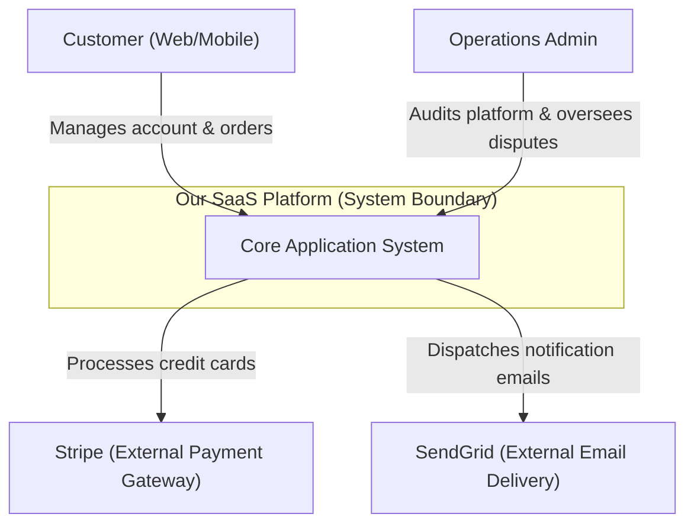
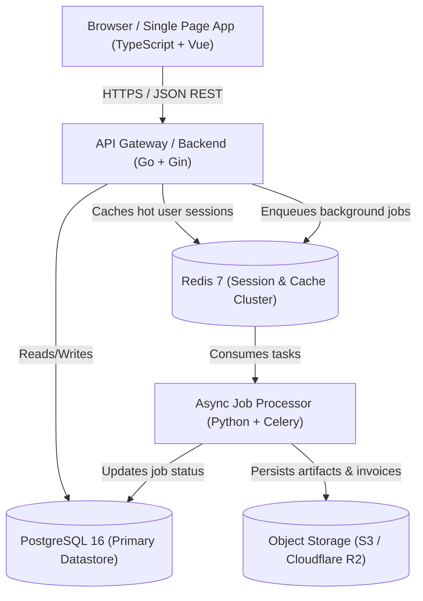
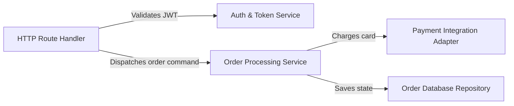

# Architecture Documentation & The C4 Model

> _"If you can't describe your system architecture in text-based code that lives in version control alongside your source code, your architecture documentation is already obsolete."_

Software architecture documentation communicates the high-level design, boundaries, responsibilities, and structural decisions of a system to engineers, architects, and stakeholders.

---

## 1. Simon Brown's C4 Architecture Model

The **C4 Model** provides a hierarchical "Google Maps" approach to zooming in on software systems across four levels of detail:

```
┌────────────────────────────────────────────────────────┐
│                   THE 4 LEVELS OF C4                   │
├────────────────────────────────────────────────────────┤
│ Level 1: System Context → Big picture: Users & Systems │
│ Level 2: Container      → High-level deployable units  │
│ Level 3: Component      → Modules inside a container   │
│ Level 4: Code           → Classes & implementation     │
└────────────────────────────────────────────────────────┘
```

### Level 1: System Context Diagram

Shows the software system in the center, surrounded by the human users who interact with it and the external third-party software systems it integrates with.

#### Mermaid Syntax Example:



---

### Level 2: Container Diagram

Zooms inside the system boundary to show the high-level deployable units (containers): web frontends, backend APIs, background workers, relational databases, cache clusters, and object stores.

#### Mermaid Syntax Example:



---

### Level 3: Component Diagram

Zooms inside a single container (such as the API Gateway) to reveal its internal modular components, service interfaces, and data repositories.

#### Mermaid Syntax Example:



---

## 2. Architecture Decision Records (ADRs)

An **Architecture Decision Record (ADR)** captures a significant architectural choice along with its context, alternatives considered, and resulting trade-offs.

### Standard MADR Template (`docs/architecture/adr-0001.md`):

```markdown
# ADR 0001: Adopt Event Sourcing for Financial Transaction Auditing

- **Status**: Accepted
- **Date**: 2026-09-30
- **Deciders**: Lead Architect, Principal Backend Engineer, Security Officer
- **Consulted**: Database Administrator, Compliance Lead

## Context & Problem Statement

Our financial ledger requires an immutable audit trail to comply with SOC2 and financial regulations. Traditional relational updates (`UPDATE accounts SET balance = ...`) lose historical mutation sequences and leave the system vulnerable to undetected tampering.

## Decision Drivers

- Absolute non-repudiation of financial transactions.
- Capability to reconstruct state at any historical point in time.
- High write throughput during market open spikes.

## Considered Options

1. **Event Sourcing with PostgreSQL Append-Only Log**
2. **Traditional Relational Updates with PostgreSQL Audit Triggers**
3. **Dedicated EventStoreDB Cluster**

## Decision Outcome

Chosen option: **Option 1 (Event Sourcing with PostgreSQL Append-Only Log)**.

### Positive Consequences

- Guarantees complete, tamper-evident transaction history.
- Leverages existing PostgreSQL expertise and infrastructure without introducing another cluster technology.
- Simplifies debugging by replaying event streams locally.

### Negative Consequences

- Increased query complexity: requires projections (read models) for fast dashboard balance queries.
- Developers must learn event-driven modeling conventions.
```
